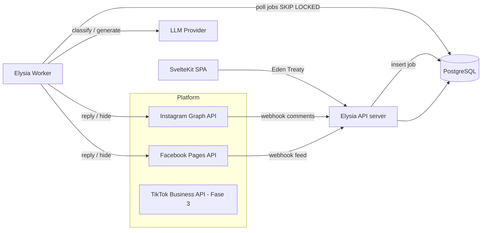
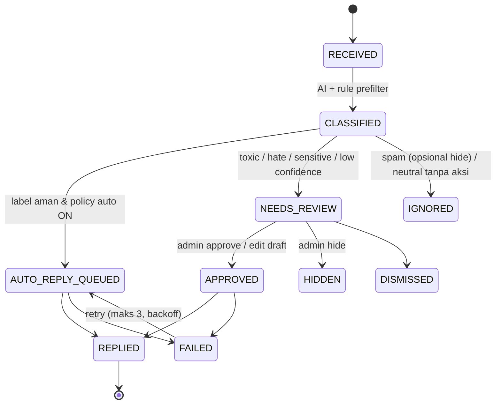
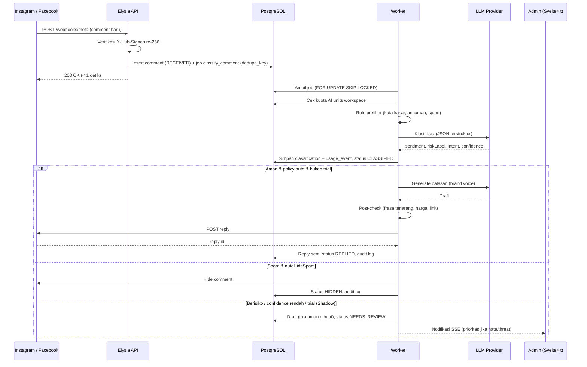
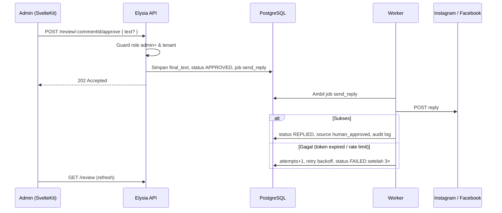
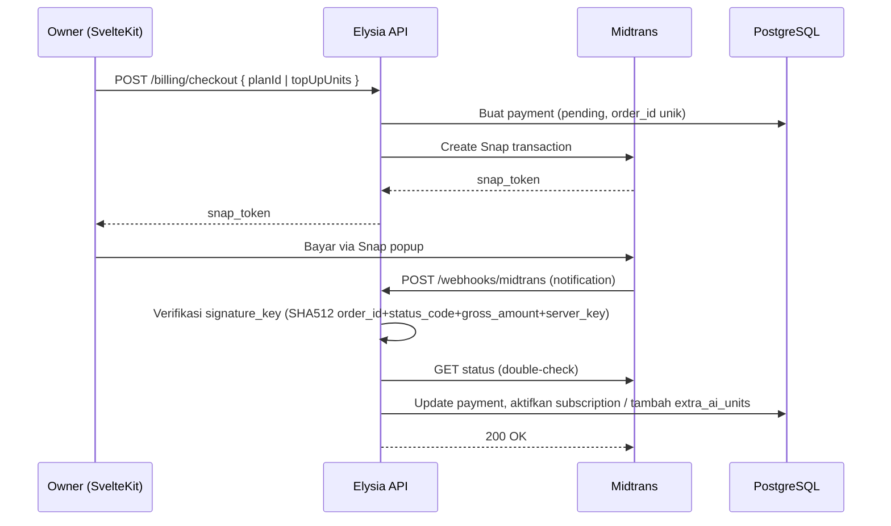
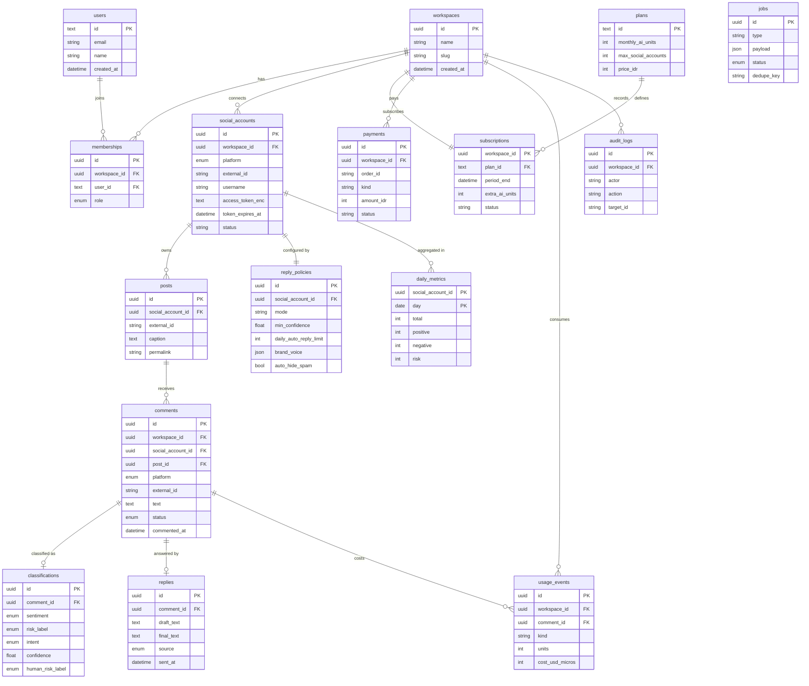

# PRD — AI Comment Management ("Replyra")

> Nama kerja: **Replyra** (ganti sesuai brand). Pilot tenant: **MauJahit.id**.
> Dokumen ini ditulis agar bisa langsung dipakai bersama AI coding agent (Claude Code, Cursor, Copilot). Tingkat keyakinan klaim teknis ditandai **[Pasti] / [Kemungkinan Besar] / [Menebak]**.

---

## 0. Risiko Utama (baca dulu)

| # | Risiko | Dampak | Keputusan PRD |
|---|--------|--------|---------------|
| R1 | **TikTok**: API resmi ada — *TikTok API for Business → Organic API → Accounts API* mendukung baca komentar & moderasi pada video milik akun bisnis (scope `comment.list`, `comment.list.manage`) **[Kemungkinan Besar]**. Yang belum terverifikasi: syarat approval app, ketersediaan untuk akun Indonesia, dan ada/tidaknya webhook komentar **[Menebak]**. Batas teks balasan 150 karakter **[Kemungkinan Besar]**. | Timeline TikTok bergantung pada approval TikTok, bukan pada development. | TikTok = **Fase 2** (setelah IG/FB stabil), di belakang feature flag. Asumsikan **polling** (bukan webhook) sampai terbukti sebaliknya. Tidak masuk materi penjualan sebelum app lolos approval & diuji di akun nyata. |
| R2 | **Meta (IG/FB)** butuh App Review + Business Verification untuk permission komentar (mis. `instagram_manage_comments`, `pages_manage_engagement`, `pages_read_user_content`) **[Kemungkinan Besar]**. Akun IG wajib Professional & terhubung ke Facebook Page **[Pasti]**. | Proses review bisa 1–4 minggu dan bisa ditolak jika screencast demo tidak jelas. | Sprint 0 = siapkan Meta App + dokumen review paralel dengan development. |
| R3 | **Auto-reply ke komentar "hate"** secara otomatis berisiko: balasan AI yang salah konteks ke komentar sensitif bisa viral dan merusak brand. | Krisis reputasi. | Default: komentar *toxic/hate/sensitive* **tidak pernah** dibalas otomatis → masuk antrean review. Hanya *positive* dan *question* sederhana yang boleh auto-reply. |
| R4 | Balasan auto yang seragam ke ratusan komentar terlihat seperti bot dan bisa terkena rate-limit/spam detection platform **[Kemungkinan Besar]**. | Akun dibatasi / reach turun. | Variasi balasan via LLM + brand voice, throttling per akun, kuota harian auto-reply. |
| R6 | **Biaya LLM ditanggung tenant** → tanpa metering, satu akun viral (ribuan komentar) bisa menghabiskan margin atau memicu tagihan mengejutkan ke klien. | Kerugian atau churn. | Metering token per workspace, kuota komentar AI per paket, hard-cap + fallback ke rule-only saat kuota habis (lihat FR-9). |
| R5 | "Negatif" ≠ "Hate". *"Produknya jelek"* adalah **keluhan** (negative-complaint), bukan ujaran kebencian. Menyamakan keduanya membuat metrik dashboard menyesatkan. | Keputusan bisnis salah. | Taksonomi 6 label (lihat §5.2). Dashboard tetap bisa diringkas jadi Positive / Neutral / Negative. |

---

## 1. Project Overview

**Masalah:** UMKM & brand (contoh: MauJahit.id) menerima ratusan komentar per hari di IG/FB. Komentar positif dan pertanyaan calon pembeli sering tidak terbalas (lost sales), sementara komentar negatif/toxic tidak tertangani cepat.

**Solusi:** Platform SaaS multi-tenant yang:
1. Menarik komentar secara otomatis (webhook + polling fallback).
2. Mengklasifikasi sentimen & risiko dengan AI.
3. Membalas otomatis komentar yang aman, menahan komentar berisiko untuk review manusia.
4. Menyajikan dashboard & laporan harian/mingguan.

**Target user:**
- **Owner** brand/UMKM — lihat ringkasan & laporan.
- **Admin/Social Media Officer** — review antrean, approve/edit balasan, atur aturan.
- **Agency** (fase 2) — kelola banyak brand dalam satu akun.

**Success metrics (90 hari pasca-launch pilot):**
- ≥ 80% komentar positif/pertanyaan terbalas < 15 menit.
- Precision klasifikasi *toxic/hate* ≥ 90% pada sampel audit manual 200 komentar.
- < 2% balasan otomatis yang dihapus/diedit manual oleh admin setelah terkirim.
- Waktu admin menangani komentar turun ≥ 50% (self-reported pilot).

**Non-goals (MVP):** DM/inbox management, penjadwalan posting, social listening di luar akun sendiri, iklan (ads comments), bahasa daerah (Sunda/Jawa). TikTok menyusul di Fase 2.

---

## 2. Tech Stack & Rekomendasi

| Layer | Pilihan | Catatan |
|-------|---------|---------|
| Runtime | **Bun** | Satu runtime untuk web, API, worker. |
| Frontend | **SvelteKit (Svelte 5) + Tailwind CSS v4** | `adapter-static` (SPA) untuk dashboard; tidak perlu SSR karena seluruh halaman di balik login. |
| Backend | **Elysia** | Pilihan tepat untuk Bun **[Kemungkinan Besar]**. Keuntungan utama: **Eden Treaty** → type-safe client end-to-end ke SvelteKit tanpa codegen. Alternatif: Hono (lebih portable, ekosistem middleware lebih besar), tapi kehilangan Eden. |
| ORM | **Drizzle ORM** + PostgreSQL 16 | `drizzle-kit` untuk migrasi. |
| Auth | **Better Auth** (adapter Drizzle) | Email+password & Google OAuth; plugin organization untuk multi-tenant **[Kemungkinan Besar]**. |
| Queue / Job | **Tabel `jobs` di Postgres** (`FOR UPDATE SKIP LOCKED`) | Mengurangi infra (tanpa Redis) untuk MVP. Pindah ke BullMQ+Redis jika > ~50 job/detik **[Menebak]**. |
| AI | LLM via port `LlmClassifier` / `LlmReplyGenerator` | Provider bisa diganti (Claude / Gemini / OpenAI / OpenRouter). Output wajib JSON terstruktur + validasi Zod/TypeBox. |
| Validasi | TypeBox (bawaan Elysia) | Dipakai juga untuk schema output LLM. |
| Chart | LayerChart atau Chart.js | Dashboard. |
| Deploy | Docker Compose di VPS (GitLab CI/CD) | 3 container: `web` (static via Caddy), `api`, `worker` + `postgres`. |

### Keputusan "satukan backend"
**Rekomendasi: satu codebase backend Elysia, dua entrypoint proses**:
- `server.ts` → HTTP API + webhook receiver.
- `worker.ts` → job consumer (klasifikasi, generate balasan, kirim balasan, polling, agregasi laporan).

Alasan: webhook Meta harus dibalas cepat (< beberapa detik) **[Kemungkinan Besar]**, sedangkan panggilan LLM lambat. Jika dicampur dalam satu proses, lonjakan komentar akan memblokir API. Domain & infrastruktur tetap satu package, hanya proses yang dipisah.

Mount Elysia di dalam route SvelteKit (`/api/[...slugs]`) memang bisa, tapi **tidak disarankan** di sini karena worker jangka panjang tetap butuh proses sendiri.

---

## 3. Arsitektur

### 3.1 Diagram sistem



### 3.2 Lifecycle komentar (state machine)



### 3.3 Sequence — komentar masuk sampai terbalas



### 3.4 Sequence — admin menyetujui draft



### 3.5 Sequence — pembayaran Midtrans



---

## 4. Domain-Driven Design

### 4.1 Bounded Contexts

| Context | Tanggung jawab | Aggregate root utama |
|---------|----------------|----------------------|
| **Identity & Workspace** | User, workspace (tenant), membership, role | `Workspace` |
| **Channel** | Koneksi akun sosial, token OAuth (terenkripsi), status sinkronisasi, webhook subscription | `SocialAccount` |
| **Engagement** (inti) | Post, Comment, lifecycle komentar | `Comment` |
| **Moderation** | Klasifikasi AI, prefilter kata kasar/ancaman, antrean review | `ModerationCase` |
| **Response** | Policy balasan, brand voice, template, draft & pengiriman balasan | `ReplyPolicy`, `Reply` |
| **Insights** | Agregasi metrik harian, laporan harian/mingguan | `DailyMetric` (read model) |

Komunikasi antar-context via **domain events** (in-process event bus + outbox di tabel `jobs`):

```
CommentReceived → (Moderation) ClassifyComment
CommentClassified → (Response) DecideReplyAction
ReplyApproved / AutoReplyScheduled → (Response) SendReply
ReplySent / ReplyFailed → (Engagement) update state, (Insights) increment metric
```

### 4.2 Ubiquitous Language

- **Comment** — komentar dari platform, identitas unik = `(platform, externalId)`.
- **Sentiment** — `positive | neutral | negative`.
- **RiskLabel** — `none | spam | toxic | hate | threat | sensitive`.
- **Intent** — `praise | purchase_intent | question | complaint | other`.
- **ReplyPolicy** — aturan per akun: label mana yang boleh auto-reply, jam aktif, kuota harian, brand voice.
- **ModerationCase** — komentar yang butuh keputusan manusia.
- **Draft** — balasan buatan AI yang belum dikirim.

### 4.3 Invariant penting (dijaga di domain layer)

1. Komentar dengan `riskLabel ∈ {toxic, hate, threat, sensitive}` **tidak boleh** berpindah ke `AUTO_REPLY_QUEUED`.
2. Komentar dengan `confidence < policy.minConfidence` (default 0.75) → `NEEDS_REVIEW`.
3. Satu komentar maksimal satu balasan dari sistem (idempoten).
4. Tidak membalas komentar milik akun brand sendiri.
5. Auto-reply per akun tidak melebihi `policy.dailyAutoReplyLimit` dan `policy.minIntervalSeconds`.
6. Semua aksi (reply, hide, approve, edit) tercatat di `audit_logs`.

### 4.4 Struktur folder (monorepo Bun workspaces)

```
replyra/
├── apps/
│   ├── web/                         # SvelteKit + Tailwind
│   │   └── src/
│   │       ├── lib/api.ts           # Eden Treaty client
│   │       ├── lib/components/
│   │       └── routes/
│   │           ├── (auth)/login/
│   │           └── (app)/[workspace]/
│   │               ├── dashboard/
│   │               ├── comments/
│   │               ├── review/
│   │               ├── accounts/
│   │               ├── policies/
│   │               └── reports/
│   └── server/                      # Elysia
│       └── src/
│           ├── server.ts            # entry HTTP
│           ├── worker.ts            # entry job consumer
│           ├── shared/
│           │   ├── domain/          # Entity, ValueObject, DomainEvent, Result
│           │   ├── infrastructure/  # db client, event bus, job queue, crypto
│           │   └── http/            # auth guard, error mapper, tenant resolver
│           └── contexts/
│               ├── identity/
│               ├── channel/
│               ├── engagement/
│               ├── moderation/
│               ├── response/
│               └── insights/
│                   # setiap context:
│                   ├── domain/          # entities, VOs, events, repository ports
│                   ├── application/     # use cases (commands/queries), DTO
│                   ├── infrastructure/  # drizzle repos, API adapters, LLM adapters
│                   └── presentation/    # Elysia plugin (routes)
├── packages/
│   └── db/                          # drizzle schema + migrations (shared)
├── docker/
├── .gitlab-ci.yml
└── package.json                     # workspaces
```

Aturan dependensi: `presentation → application → domain`; `infrastructure` mengimplementasikan port dari `domain`. Domain **tidak** mengimpor Drizzle, Elysia, atau SDK platform.

---

## 5. Requirements

### 5.1 Functional Requirements

**FR-1 Workspace & Auth**
- Register/login (email + Google).
- Workspace multi-tenant; role: `owner`, `admin`, `viewer`.
- Undang anggota via email.

**FR-2 Koneksi Akun Sosial**
- Connect Facebook Page & Instagram Professional via Facebook Login (OAuth).
- Simpan long-lived token terenkripsi (AES-256-GCM, key dari env).
- Tampilkan status: connected / token expired / permission missing.
- Subscribe webhook otomatis saat connect.

**FR-3 Ingestion Komentar**
- Terima webhook komentar baru (IG `comments`, FB `feed`).
- Polling fallback tiap 10 menit untuk 20 post terakhir per akun (menangkap webhook yang hilang).
- Dedup berdasarkan `(platform, external_id)`.
- Simpan post terkait (caption, permalink, thumbnail).

**FR-4 Klasifikasi**
- Tahap 1 — **rule prefilter** (deterministik): daftar kata kasar/ancaman Bahasa Indonesia + slang + custom keyword per workspace; pola spam (link, nomor WA, "cek bio").
- Tahap 2 — **LLM classifier**: output JSON `{ sentiment, riskLabel, intent, confidence, language, reason }`.
- Jika prefilter menandai risiko, hasil LLM tidak boleh menurunkan risiko (ambil yang terberat).
- Admin bisa koreksi label → disimpan sebagai `human_label` (data evaluasi).

**FR-5 Balasan**
- Generate balasan dengan brand voice per akun (nama brand, gaya bahasa, emoji on/off, CTA default mis. "DM kami").
- **Info Bisnis (knowledge base ringan)** per akun, teks bebas ≤ 3.000 karakter: harga/range harga, estimasi pengerjaan, cara order & DP, ukuran, lokasi/jam buka, pengiriman. AI **menjawab langsung** pertanyaan yang faktanya ada di sini; bila tidak ada → satu pertanyaan klarifikasi atau arahkan ke DM. AI tidak boleh mengarang angka.
- **Contoh balasan ideal** (≤ 5) per akun sebagai acuan gaya (few-shot), bukan template yang disalin.
- Balasan tidak seragam: jawab isi komentar dulu, variasikan pembuka, CTA hanya saat relevan (mitigasi R4).
- Auto-reply untuk label yang diizinkan policy (default: `positive/praise`, `positive/purchase_intent`, `neutral/question` sederhana).
- Komentar `negative/complaint` tanpa risiko → default **draft + review**; bisa diubah jadi auto oleh owner.
- Antrean review: approve, edit lalu kirim, regenerate, hide komentar, dismiss.
- Throttling & kuota harian per akun.
- Mode **"Shadow"** (default 7 hari pertama): AI mengklasifikasi & membuat draft tapi tidak mengirim apa pun — untuk kalibrasi.

**FR-6 Dashboard**
- Kartu ringkasan: Total, Positive, Neutral, Negative, Risk (toxic+hate+threat+sensitive), Spam.
- Grafik tren harian per sentimen.
- Aktivitas AI: auto-replied, drafted, pending review, failed.
- Median waktu respons.
- Filter: akun, platform, rentang tanggal.
- Tabel komentar terbaru dengan badge label & status.

**FR-7 Laporan**
- Laporan harian & mingguan: jumlah komentar, distribusi sentimen, komentar dibalas (auto vs manual), top post by komentar, komentar risiko.
- Export CSV & PDF.
- Kirim email terjadwal ke owner (opsional).
- Engagement metrics (likes/reach) butuh permission insights tambahan **[Kemungkinan Besar]** → P1.

**FR-9 Usage Metering & Billing (P0 — karena SaaS & biaya LLM ditanggung tenant)**
- Catat setiap panggilan LLM: workspace, jenis (classify/reply), model, input/output token, estimasi biaya.
- Kuota per paket dihitung dalam **"AI comments"** (1 komentar yang diklasifikasi = 1 unit; generate balasan = +1 unit) — lebih mudah dipahami klien daripada token.
- Notifikasi pemakaian 80% & 100%.
- Saat kuota habis: klasifikasi turun ke **rule prefilter saja**, semua komentar masuk review, auto-reply berhenti. Tidak ada komentar yang hilang.
- Top-up kuota / upgrade paket; pembayaran via **Midtrans** — P1.
- Opsi **BYOK** (tenant pakai API key LLM sendiri) untuk paket agency — P2.

**FR-8 Audit & Keamanan**
- Audit log semua aksi manusia & sistem.
- Hapus data workspace saat disconnect / request (compliance Meta Data Deletion callback).

### 5.2 Taksonomi label

| Dimensi | Nilai |
|---------|-------|
| sentiment | `positive`, `neutral`, `negative` |
| riskLabel | `none`, `spam`, `toxic` (kasar), `hate` (SARA/ujaran kebencian), `threat` (ancaman), `sensitive` (isu politik, kesehatan, hukum, data pribadi) |
| intent | `praise`, `purchase_intent`, `question`, `complaint`, `other` |

Mapping ke dashboard ringkas: **Positive** = positive & risk none; **Neutral** = neutral & risk none; **Negative** = negative & risk none; **Hate/Risk** = risk ∈ {toxic, hate, threat, sensitive}; **Spam** terpisah.

### 5.3 Contoh perilaku

| Komentar | Klasifikasi | Aksi default |
|----------|-------------|--------------|
| "Produknya bagus banget, mau order dong!" | positive · none · purchase_intent | Auto-reply: "Terima kasih kak 🙏 Silakan DM kami, tim MauJahit siap bantu 😊" |
| "Bisa jahit kebaya ukuran custom?" | neutral · none · question | Auto-reply jika policy `question` ON, else draft |
| "Produknya jelek, jangan beli di sini!" | negative · none · complaint | **Draft + review**: "Mohon maaf kalau ada pengalaman yang kurang sesuai. Silakan DM detailnya agar tim kami bisa membantu." |
| Komentar berisi makian kasar | negative · toxic | Review; opsi hide |
| Komentar SARA / ancaman | negative · hate/threat | Review prioritas tinggi + notifikasi admin; tidak ada draft balasan otomatis |
| "Cek bio aku kak, promo 90%!!" | neutral · spam | Ignore (opsional auto-hide) |

### 5.4 Non-Functional Requirements

- **Latensi:** webhook di-ACK < 1 detik (hanya insert job). Komentar terklasifikasi p95 < 60 detik.
- **Reliabilitas:** job retry eksponensial maks 3×; dead-letter status `FAILED` terlihat di UI.
- **Idempotensi:** semua handler job idempoten (cek state sebelum aksi).
- **Keamanan:** verifikasi signature webhook (`X-Hub-Signature-256`); token terenkripsi; row-level tenant scoping di setiap repository (wajib `workspaceId`).
- **Privasi:** hanya simpan data komentar dari akun yang terhubung; retensi default 12 bulan.
- **Biaya AI:** batch klasifikasi (hingga 20 komentar/panggilan) saat backlog; cache hasil untuk teks identik.
- **Observability:** structured log (pino), metrik job (processed, failed, latency), health endpoint.
- **Responsif:** dashboard usable di mobile (360px).

---

## 6. Features & Prioritas

| ID | Fitur | Prioritas |
|----|-------|-----------|
| F1 | Auth + workspace + role | P0 |
| F2 | Connect Facebook Page & Instagram | P0 |
| F3 | Webhook ingestion + polling fallback | P0 |
| F4 | Rule prefilter + LLM classifier | P0 |
| F5 | Reply policy + brand voice | P0 |
| F6 | Antrean review (approve/edit/hide/dismiss) | P0 |
| F7 | Auto-reply dengan throttling + Shadow mode | P0 |
| F8 | Dashboard ringkasan + tren | P0 |
| F9 | Audit log | P0 |
| F10 | Laporan harian/mingguan + export CSV | P1 |
| F11 | Export PDF + email terjadwal | P1 |
| F12 | Engagement metrics (insights) | P1 |
| F13 | Koreksi label → dataset evaluasi & akurasi per label | P1 |
| F14 | Notifikasi real-time (SSE) untuk komentar risiko | P1 |
| F15 | Multi-brand untuk agency | P2 |
| F16 | TikTok via Organic Accounts API (polling, setelah app approved) | P1 / Fase 2 |
| F17 | Usage metering + kuota per paket + fallback rule-only | P0 |
| F18 | Pembayaran & langganan (Midtrans/Xendit) | P1 |
| F19 | BYOK LLM key | P2 |

---

## 7. Database Schema (Drizzle / PostgreSQL)

### 7.1 ERD



### 7.2 Deskripsi tabel

| Tabel | Context | Deskripsi |
|-------|---------|-----------|
| **users** | Identity | Dikelola Better Auth (plus tabel `session`, `account`, `verification` bawaan). |
| **workspaces** | Identity | Tenant. Semua data bisnis ter-scope ke workspace. |
| **memberships** | Identity | Relasi user ↔ workspace beserta role (owner/admin/viewer). |
| **social_accounts** | Channel | Akun IG/FB/TikTok yang terhubung, token terenkripsi, status koneksi. |
| **posts** | Engagement | Post/video sumber komentar (caption dipakai sebagai konteks AI). |
| **comments** | Engagement | Komentar + status lifecycle (§3.2). Unik per `(platform, external_id)`. |
| **classifications** | Moderation | Hasil AI + prefilter, plus koreksi manusia untuk evaluasi. |
| **replies** | Response | Draft AI, teks final, sumber (auto/human), status kirim & retry. |
| **reply_policies** | Response | Mode Shadow/Assisted/Auto, intent yang boleh auto, kuota, brand voice, auto-hide spam. |
| **plans** | Billing | Paket langganan: harga IDR, AI units/bulan, batas akun sosial. |
| **subscriptions** | Billing | Paket aktif workspace, periode, top-up units, status (trial/active/past_due/canceled). |
| **payments** | Billing | Transaksi Midtrans (langganan & top-up), status dari notification. |
| **usage_events** | Billing | Ledger pemakaian LLM per panggilan (unit, token, biaya). Sumber kebenaran kuota. |
| **daily_metrics** | Insights | Read model agregat harian untuk dashboard & laporan. |
| **audit_logs** | Shared | Jejak semua aksi manusia & sistem. |
| **jobs** | Shared | Antrean job Postgres (outbox + worker), idempoten via `dedupe_key`. |

### 7.3 Drizzle schema

```ts
// packages/db/src/schema.ts (ringkas)
import { pgTable, uuid, text, timestamp, integer, real, boolean, jsonb, pgEnum, uniqueIndex, index, date } from 'drizzle-orm/pg-core';

export const platformEnum   = pgEnum('platform', ['instagram', 'facebook', 'tiktok']);
export const roleEnum       = pgEnum('role', ['owner', 'admin', 'viewer']);
export const sentimentEnum  = pgEnum('sentiment', ['positive', 'neutral', 'negative']);
export const riskEnum       = pgEnum('risk_label', ['none', 'spam', 'toxic', 'hate', 'threat', 'sensitive']);
export const intentEnum     = pgEnum('intent', ['praise', 'purchase_intent', 'question', 'complaint', 'other']);
export const commentStatus  = pgEnum('comment_status', ['RECEIVED','CLASSIFIED','AUTO_REPLY_QUEUED','NEEDS_REVIEW','APPROVED','REPLIED','HIDDEN','DISMISSED','IGNORED','FAILED']);
export const replySource    = pgEnum('reply_source', ['auto', 'human_approved', 'human_written']);
export const jobStatus      = pgEnum('job_status', ['pending', 'running', 'done', 'failed']);

export const workspaces = pgTable('workspaces', {
  id: uuid('id').primaryKey().defaultRandom(),
  name: text('name').notNull(),
  slug: text('slug').notNull().unique(),
  createdAt: timestamp('created_at').defaultNow().notNull(),
});

export const memberships = pgTable('memberships', {
  id: uuid('id').primaryKey().defaultRandom(),
  workspaceId: uuid('workspace_id').references(() => workspaces.id, { onDelete: 'cascade' }).notNull(),
  userId: text('user_id').notNull(),            // dari Better Auth
  role: roleEnum('role').notNull(),
}, t => [uniqueIndex('uq_member').on(t.workspaceId, t.userId)]);

export const socialAccounts = pgTable('social_accounts', {
  id: uuid('id').primaryKey().defaultRandom(),
  workspaceId: uuid('workspace_id').references(() => workspaces.id, { onDelete: 'cascade' }).notNull(),
  platform: platformEnum('platform').notNull(),
  externalId: text('external_id').notNull(),     // IG user id / Page id
  username: text('username').notNull(),
  avatarUrl: text('avatar_url'),
  accessTokenEnc: text('access_token_enc').notNull(),
  tokenExpiresAt: timestamp('token_expires_at'),
  scopes: text('scopes').array(),
  status: text('status').notNull().default('connected'), // connected | expired | revoked
  lastSyncedAt: timestamp('last_synced_at'),
}, t => [uniqueIndex('uq_account').on(t.platform, t.externalId)]);

export const posts = pgTable('posts', {
  id: uuid('id').primaryKey().defaultRandom(),
  socialAccountId: uuid('social_account_id').references(() => socialAccounts.id, { onDelete: 'cascade' }).notNull(),
  externalId: text('external_id').notNull(),
  caption: text('caption'),
  permalink: text('permalink'),
  mediaUrl: text('media_url'),
  publishedAt: timestamp('published_at'),
}, t => [uniqueIndex('uq_post').on(t.socialAccountId, t.externalId)]);

export const comments = pgTable('comments', {
  id: uuid('id').primaryKey().defaultRandom(),
  workspaceId: uuid('workspace_id').notNull(),
  socialAccountId: uuid('social_account_id').references(() => socialAccounts.id, { onDelete: 'cascade' }).notNull(),
  postId: uuid('post_id').references(() => posts.id),
  platform: platformEnum('platform').notNull(),
  externalId: text('external_id').notNull(),
  parentExternalId: text('parent_external_id'),
  authorName: text('author_name'),
  authorExternalId: text('author_external_id'),
  text: text('text').notNull(),
  commentedAt: timestamp('commented_at').notNull(),
  status: commentStatus('status').notNull().default('RECEIVED'),
  receivedAt: timestamp('received_at').defaultNow().notNull(),
}, t => [
  uniqueIndex('uq_comment').on(t.platform, t.externalId),
  index('ix_comment_ws_status').on(t.workspaceId, t.status),
  index('ix_comment_ws_date').on(t.workspaceId, t.commentedAt),
]);

export const classifications = pgTable('classifications', {
  id: uuid('id').primaryKey().defaultRandom(),
  commentId: uuid('comment_id').references(() => comments.id, { onDelete: 'cascade' }).notNull().unique(),
  sentiment: sentimentEnum('sentiment').notNull(),
  riskLabel: riskEnum('risk_label').notNull(),
  intent: intentEnum('intent').notNull(),
  confidence: real('confidence').notNull(),
  reason: text('reason'),
  prefilterHits: text('prefilter_hits').array(),
  model: text('model').notNull(),
  humanSentiment: sentimentEnum('human_sentiment'),
  humanRiskLabel: riskEnum('human_risk_label'),
  correctedBy: text('corrected_by'),
  createdAt: timestamp('created_at').defaultNow().notNull(),
});

export const replyPolicies = pgTable('reply_policies', {
  id: uuid('id').primaryKey().defaultRandom(),
  socialAccountId: uuid('social_account_id').references(() => socialAccounts.id, { onDelete: 'cascade' }).notNull().unique(),
  mode: text('mode').notNull().default('shadow'),          // shadow | assisted | auto
  autoReplyIntents: intentEnum('auto_reply_intents').array().notNull(),
  minConfidence: real('min_confidence').notNull().default(0.75),
  dailyAutoReplyLimit: integer('daily_auto_reply_limit').notNull().default(200),
  minIntervalSeconds: integer('min_interval_seconds').notNull().default(20),
  activeHours: jsonb('active_hours'),                       // { start: "08:00", end: "22:00", tz: "Asia/Jakarta" }
  brandVoice: jsonb('brand_voice').notNull(),               // { brandName, tone, useEmoji, cta, forbiddenPhrases[] }
  customBlockedKeywords: text('custom_blocked_keywords').array(),
  autoHideSpam: boolean('auto_hide_spam').notNull().default(true),   // keputusan pilot: ON default
});

export const replies = pgTable('replies', {
  id: uuid('id').primaryKey().defaultRandom(),
  commentId: uuid('comment_id').references(() => comments.id, { onDelete: 'cascade' }).notNull().unique(),
  draftText: text('draft_text').notNull(),
  finalText: text('final_text'),
  source: replySource('source'),
  externalReplyId: text('external_reply_id'),
  approvedBy: text('approved_by'),
  sentAt: timestamp('sent_at'),
  error: text('error'),
  attempts: integer('attempts').notNull().default(0),
});

export const jobs = pgTable('jobs', {
  id: uuid('id').primaryKey().defaultRandom(),
  type: text('type').notNull(),          // classify_comment | generate_reply | send_reply | poll_account | aggregate_daily
  payload: jsonb('payload').notNull(),
  status: jobStatus('status').notNull().default('pending'),
  runAt: timestamp('run_at').defaultNow().notNull(),
  attempts: integer('attempts').notNull().default(0),
  lastError: text('last_error'),
  dedupeKey: text('dedupe_key').unique(),
}, t => [index('ix_jobs_pick').on(t.status, t.runAt)]);

export const dailyMetrics = pgTable('daily_metrics', {
  workspaceId: uuid('workspace_id').notNull(),
  socialAccountId: uuid('social_account_id').notNull(),
  day: date('day').notNull(),
  total: integer('total').notNull().default(0),
  positive: integer('positive').notNull().default(0),
  neutral: integer('neutral').notNull().default(0),
  negative: integer('negative').notNull().default(0),
  risk: integer('risk').notNull().default(0),
  spam: integer('spam').notNull().default(0),
  autoReplied: integer('auto_replied').notNull().default(0),
  manualReplied: integer('manual_replied').notNull().default(0),
  medianResponseSec: integer('median_response_sec'),
}, t => [uniqueIndex('uq_daily').on(t.socialAccountId, t.day)]);

export const plans = pgTable('plans', {
  id: text('id').primaryKey(),                 // starter | growth | agency
  name: text('name').notNull(),
  monthlyAiUnits: integer('monthly_ai_units').notNull(),
  maxSocialAccounts: integer('max_social_accounts').notNull(),
  priceIdr: integer('price_idr').notNull(),
});

export const subscriptions = pgTable('subscriptions', {
  workspaceId: uuid('workspace_id').primaryKey().references(() => workspaces.id, { onDelete: 'cascade' }),
  planId: text('plan_id').references(() => plans.id).notNull(),
  periodStart: timestamp('period_start').notNull(),
  periodEnd: timestamp('period_end').notNull(),
  extraAiUnits: integer('extra_ai_units').notNull().default(0),   // top-up
  status: text('status').notNull().default('active'),            // trial | active | past_due | canceled
});

export const payments = pgTable('payments', {
  id: uuid('id').primaryKey().defaultRandom(),
  workspaceId: uuid('workspace_id').references(() => workspaces.id, { onDelete: 'cascade' }).notNull(),
  orderId: text('order_id').notNull().unique(),          // dikirim ke Midtrans
  kind: text('kind').notNull(),                          // subscription | top_up
  planId: text('plan_id').references(() => plans.id),
  aiUnits: integer('ai_units'),                          // untuk top_up
  amountIdr: integer('amount_idr').notNull(),
  status: text('status').notNull().default('pending'),   // pending | settlement | expire | cancel | deny | refund
  midtransTransactionId: text('midtrans_transaction_id'),
  paymentType: text('payment_type'),                     // qris | bank_transfer | gopay | ...
  rawNotification: jsonb('raw_notification'),
  paidAt: timestamp('paid_at'),
  createdAt: timestamp('created_at').defaultNow().notNull(),
});

export const usageEvents = pgTable('usage_events', {
  id: uuid('id').primaryKey().defaultRandom(),
  workspaceId: uuid('workspace_id').notNull(),
  commentId: uuid('comment_id'),
  kind: text('kind').notNull(),                // classify | generate_reply
  units: integer('units').notNull().default(1),
  model: text('model').notNull(),
  inputTokens: integer('input_tokens').notNull(),
  outputTokens: integer('output_tokens').notNull(),
  costUsdMicros: integer('cost_usd_micros').notNull(),
  createdAt: timestamp('created_at').defaultNow().notNull(),
}, t => [index('ix_usage_ws_date').on(t.workspaceId, t.createdAt)]);

export const auditLogs = pgTable('audit_logs', {
  id: uuid('id').primaryKey().defaultRandom(),
  workspaceId: uuid('workspace_id').notNull(),
  actor: text('actor').notNull(),         // userId | 'system'
  action: text('action').notNull(),       // reply.sent, comment.hidden, label.corrected, policy.updated, ...
  targetType: text('target_type').notNull(),
  targetId: text('target_id').notNull(),
  meta: jsonb('meta'),
  createdAt: timestamp('created_at').defaultNow().notNull(),
}, t => [index('ix_audit_ws').on(t.workspaceId, t.createdAt)]);
```

---

## 8. API Design (Elysia)

Semua route di bawah `/api/v1/workspaces/:ws/*` melewati guard `auth` + `tenant` (cek membership & role).

| Method | Path | Deskripsi | Role |
|--------|------|-----------|------|
| POST | `/api/auth/*` | Better Auth handler | — |
| GET | `/api/v1/workspaces` | List workspace user | any |
| POST | `/api/v1/workspaces` | Buat workspace | any |
| GET | `/api/v1/workspaces/:ws/accounts` | List akun sosial | viewer+ |
| GET | `/api/v1/workspaces/:ws/accounts/connect/meta` | Mulai OAuth Meta | admin+ |
| GET | `/api/v1/oauth/meta/callback` | Callback OAuth → simpan akun | — |
| DELETE | `/api/v1/workspaces/:ws/accounts/:id` | Disconnect + hapus data | owner |
| GET | `/api/v1/workspaces/:ws/comments` | List + filter (status, label, akun, tanggal, q), cursor pagination | viewer+ |
| GET | `/api/v1/workspaces/:ws/comments/:id` | Detail + klasifikasi + reply + audit | viewer+ |
| PATCH | `/api/v1/workspaces/:ws/comments/:id/label` | Koreksi label manual | admin+ |
| GET | `/api/v1/workspaces/:ws/review` | Antrean NEEDS_REVIEW (prioritas risk) | admin+ |
| POST | `/api/v1/workspaces/:ws/review/:commentId/approve` | Kirim draft (opsional `text` hasil edit) | admin+ |
| POST | `/api/v1/workspaces/:ws/review/:commentId/regenerate` | Generate ulang draft | admin+ |
| POST | `/api/v1/workspaces/:ws/review/:commentId/hide` | Hide komentar di platform | admin+ |
| POST | `/api/v1/workspaces/:ws/review/:commentId/dismiss` | Tutup tanpa aksi | admin+ |
| GET/PUT | `/api/v1/workspaces/:ws/accounts/:id/policy` | Baca/ubah reply policy | admin+ (PUT: owner jika mode→auto) |
| POST | `/api/v1/workspaces/:ws/accounts/:id/policy/preview` | Uji brand voice ke komentar contoh | admin+ |
| GET | `/api/v1/workspaces/:ws/dashboard/summary` | Kartu ringkasan | viewer+ |
| GET | `/api/v1/workspaces/:ws/dashboard/trend` | Tren harian | viewer+ |
| GET | `/api/v1/workspaces/:ws/reports?period=daily\|weekly&from&to` | Data laporan | viewer+ |
| GET | `/api/v1/workspaces/:ws/reports/export.csv` | Export CSV | viewer+ |
| GET | `/api/v1/workspaces/:ws/audit-logs` | Audit log | owner |
| GET | `/api/v1/plans` | Daftar paket & harga | — |
| GET | `/api/v1/workspaces/:ws/billing` | Paket aktif, sisa AI units, riwayat pembayaran | owner |
| POST | `/api/v1/workspaces/:ws/billing/checkout` | Buat transaksi Midtrans Snap (langganan / top-up) | owner |
| GET | `/api/v1/workspaces/:ws/usage` | Pemakaian AI units per hari | admin+ |
| POST | `/webhooks/midtrans` | Notification Midtrans (verifikasi `signature_key`) | — |
| GET | `/webhooks/meta` | Verifikasi subscription (hub.challenge) | — |
| POST | `/webhooks/meta` | Terima event, verifikasi signature, enqueue job | — |
| POST | `/webhooks/meta/data-deletion` | Callback penghapusan data Meta | — |
| GET | `/health` | Health check | — |

---

## 9. AI Design

### 9.1 Prompt klasifikasi (ringkas)
- System: peran moderator komentar brand Indonesia; pahami slang, singkatan, campuran bahasa daerah, sarkasme.
- Input: teks komentar, caption post (konteks), nama brand.
- Output wajib JSON sesuai schema §5.2 + `confidence` 0–1 + `reason` ≤ 20 kata.
- Validasi output dengan TypeBox; gagal parse → retry 1× → jika tetap gagal: `NEEDS_REVIEW`.

### 9.2 Prompt balasan
- Input: komentar, klasifikasi, caption, brand voice, CTA, daftar frasa terlarang, **Info Bisnis**, **contoh balasan brand**.
- Aturan: ≤ 2 kalimat; jawab pertanyaannya dulu; harga/diskon/estimasi/stok/kebijakan **hanya** jika tertulis di Info Bisnis; pujian → terima kasih spesifik tanpa CTA; keluhan → akui + maaf singkat + DM; ikuti bahasa pengomentar; variasikan pembuka; tidak menyebut data pribadi, link, nomor telepon; tidak berdebat.
- Post-check: frasa terlarang / link / **angka harga yang tidak ada di Info Bisnis** → turun ke `NEEDS_REVIEW` (tidak pernah auto-send).
- Simulator di halaman Policies (`/policy/preview`): komentar + caption contoh → klasifikasi, keputusan policy, draft, post-check, dan status AI (provider/model aktif, kuota, error terakhir) agar owner bisa memastikan AI benar-benar jalan sebelum pindah dari Shadow.
- Provider: Claude Haiku (default), OpenAI, Gemini, DeepSeek via `LLM_PROVIDER`. Catatan: Gemini free tier boleh dipakai Google untuk training → hanya untuk uji coba, bukan data tenant produksi.

### 9.3 Evaluasi
- Dataset seed: 300 komentar nyata MauJahit (dianonimkan) dilabeli manual.
- Target sebelum mode `auto` diizinkan: precision risk ≥ 90%, recall risk ≥ 85%, accuracy sentimen ≥ 85%.
- Koreksi label dari admin (F13) otomatis masuk dataset evaluasi.

---

## 10. UI Pages (SvelteKit)

1. **Login / Register**
2. **Onboarding** — buat workspace → connect akun → set brand voice → Shadow mode aktif.
3. **Dashboard** — kartu `Positive 125 | Neutral 43 | Negative 20 | Risk 18 | Spam 9`, grafik tren, aktivitas AI, akun terhubung.
4. **Comments** — tabel + filter, badge label, status, link ke post.
5. **Review Queue** — kartu per komentar: teks, konteks post, label + alasan AI, draft balasan editable, tombol Approve / Regenerate / Hide / Dismiss; shortcut keyboard (A, R, H, D).
6. **Accounts** — daftar akun, status token, tombol reconnect.
7. **Policies** — mode (Shadow/Assisted/Auto), intent yang auto-reply, kuota, jam aktif, brand voice, preview.
8. **Reports** — pilih periode, tabel & grafik, export.
9. **Settings** — anggota & role, audit log.
10. **Billing** — paket aktif, sisa AI units (progress bar), top-up, riwayat pembayaran, upgrade.

### 10.1 User Flow

**A. Onboarding tenant baru (trial)**
1. **Register:** owner daftar via email/Google → otomatis dibuat workspace + subscription `trial` (Shadow mode terkunci).
2. **Connect akun:** klik "Hubungkan Instagram/Facebook" → OAuth Meta → pilih Page & akun IG → sistem subscribe webhook & tarik 20 post terakhir.
3. **Brand voice:** isi nama brand, gaya bahasa (santai/formal), emoji on/off, CTA default ("Silakan DM kami"), **Info Bisnis** (harga, estimasi, cara order) dan 2–5 contoh balasan ideal → coba simulasi pada komentar contoh.
4. **Shadow berjalan:** komentar baru terklasifikasi & draft dibuat, tapi tidak ada yang dikirim. Dashboard mulai terisi.
5. **Evaluasi:** owner membuka Review Queue, melihat draft AI, mengoreksi label yang salah.
6. **Upgrade:** banner "Aktifkan balasan otomatis" → pilih paket → bayar via Midtrans → mode Assisted/Auto terbuka.

**B. Harian — Admin/Social Media Officer**
1. **Login** → Dashboard: cek ringkasan & jumlah pending review.
2. **Notifikasi risiko:** jika ada komentar hate/threat, badge merah + notifikasi → buka Review Queue (terurut prioritas risiko).
3. **Review:** per komentar pilih Approve (kirim draft), Edit lalu kirim, Regenerate, Hide, atau Dismiss.
4. **Monitoring auto-reply:** buka Comments dengan filter `status = REPLIED, source = auto` untuk spot-check balasan AI.
5. **Koreksi:** jika label salah, ubah label → tersimpan untuk evaluasi akurasi.

**C. Mingguan — Owner**
1. Buka **Reports** → pilih "Mingguan" → lihat distribusi sentimen, komentar terbalas, top post.
2. Export CSV/PDF atau terima via email terjadwal.
3. Cek **Billing** → sisa AI units; top-up jika mendekati habis (notifikasi 80%).
4. Sesuaikan **Policies** (tambah intent auto-reply, ubah kuota) berdasarkan laporan.

**D. Kuota habis**
1. Notifikasi 100% ke owner.
2. Sistem otomatis beralih ke rule-only: semua komentar masuk Review Queue, auto-reply berhenti.
3. Owner top-up/upgrade → pemrosesan AI dilanjutkan untuk komentar baru (backlog bisa diproses ulang dengan tombol "Proses dengan AI").

---

## 11. Task Breakdown

### Sprint 0 — Setup & Akses Platform (paralel)
- [ ] Buat Meta App, Business Verification, siapkan privacy policy & data deletion URL.
- [ ] Monorepo Bun workspaces, lint/format, `.gitlab-ci.yml`, Docker Compose (postgres, api, worker, web).
- [ ] `packages/db`: schema Drizzle + migrasi awal.
- [ ] Shared kernel: `Entity`, `ValueObject`, `DomainEvent`, `Result`, event bus in-process, job queue Postgres.

### Sprint 1 — Identity & Channel
- [ ] Better Auth + Google OAuth, workspace & membership, tenant guard Elysia.
- [ ] OAuth Meta: list Page + IG akun tertaut, simpan token terenkripsi.
- [ ] Subscribe webhook, endpoint verifikasi & signature check.
- [ ] UI: login, onboarding, accounts.

### Sprint 2 — Engagement & Moderation
- [ ] Webhook → `CommentReceived` → job `classify_comment`.
- [ ] Polling fallback job per akun.
- [ ] Rule prefilter (kamus kata kasar/ancaman ID + custom keyword).
- [ ] LLM classifier adapter + validasi + batching.
- [ ] UI: comments list & detail.

### Sprint 3 — Response
- [ ] ReplyPolicy aggregate + invariant (§4.3) + unit test domain.
- [ ] Generate draft, post-check, Shadow/Assisted/Auto mode.
- [ ] Send reply & hide via Graph API, retry & idempotensi.
- [ ] UI: review queue, policies, preview brand voice.
- [ ] Rekam screencast untuk Meta App Review.

### Sprint 4 — Insights & Hardening
- [ ] Job agregasi `daily_metrics` + endpoint dashboard.
- [ ] UI dashboard + reports + export CSV.
- [ ] Audit log UI, SSE notifikasi komentar risiko.
- [ ] Evaluasi AI pada dataset seed; tuning prompt.
- [ ] Load test: 1.000 komentar masuk dalam 5 menit.

### Sprint 5 — Pilot MauJahit.id
- [ ] 7 hari Shadow mode → review akurasi bersama tim MauJahit.
- [ ] Aktifkan Assisted → Auto untuk intent `praise` & `purchase_intent`.
- [ ] Laporan mingguan pertama ke owner.

### Fase berikutnya
- P1: PDF & email report, engagement insights, dataset koreksi.
- P1: **Belajar dari editan admin** — balasan yang diedit lalu dikirim admin otomatis jadi contoh few-shot (per akun, 5 terbaru), dan diff draft vs final dipakai untuk evaluasi kualitas balasan.
- P1: Info Bisnis terstruktur (katalog produk + harga + estimasi) dan konteks per post (caption + harga produk di post itu).
- P2: agency multi-brand, billing, TikTok (setelah akses API dikonfirmasi).

---

## 12. Acceptance Criteria (contoh kunci)

- **AC-1** Diberikan komentar berlabel `hate`, ketika policy mode = `auto`, maka komentar berstatus `NEEDS_REVIEW` dan tidak ada panggilan API reply.
- **AC-2** Webhook yang sama dikirim 3× menghasilkan tepat 1 baris `comments` dan maksimal 1 balasan.
- **AC-3** Saat `dailyAutoReplyLimit` tercapai, komentar positif berikutnya masuk `NEEDS_REVIEW` dengan alasan `quota_exceeded`.
- **AC-4** Webhook dengan signature tidak valid → HTTP 401, tidak ada job dibuat.
- **AC-5** User role `viewer` memanggil endpoint approve → HTTP 403.
- **AC-6** Dashboard summary untuk rentang tanggal cocok dengan hitungan manual dari tabel `comments` (toleransi 0).
- **AC-7** Token kedaluwarsa → status akun `expired`, banner reconnect muncul, job polling akun tersebut berhenti.

---

## 13. Environment Variables

```
DATABASE_URL=
BETTER_AUTH_SECRET=
BETTER_AUTH_URL=
GOOGLE_CLIENT_ID=
GOOGLE_CLIENT_SECRET=
META_APP_ID=
META_APP_SECRET=
META_WEBHOOK_VERIFY_TOKEN=
META_GRAPH_VERSION=
TOKEN_ENCRYPTION_KEY=        # 32 byte base64
LLM_PROVIDER=                # anthropic | gemini | openai | openrouter
LLM_API_KEY=
LLM_MODEL_CLASSIFY=
LLM_MODEL_REPLY=
PUBLIC_API_URL=
```

---

## 14. Keputusan (resolved)

| # | Pertanyaan | Keputusan |
|---|-----------|-----------|
| 1 | Internal MauJahit atau SaaS? | **SaaS multi-tenant**. MauJahit.id = tenant pilot pertama. |
| 2 | Siapa menanggung biaya LLM? | **Tenant**, via kuota "AI comments" per paket + top-up (FR-9). |
| 3 | Auto-hide spam default saat pilot? | **Ya, ON default** (tetap tercatat di audit log & bisa di-unhide). |
| 4 | Bahasa daerah di MVP? | **Tidak**. MVP: Bahasa Indonesia (termasuk slang) + Inggris. |
| 5 | TikTok? | API resmi tersedia (Organic Accounts API). TikTok = Fase 2 setelah app approved & diuji; lihat §15. |
| 6 | Trial? | Trial **hanya Shadow mode**: klasifikasi + draft, tanpa kirim balasan/hide. Kuota AI units trial dibatasi. |
| 7 | Payment gateway? | **Midtrans** (Snap untuk checkout, notifikasi via HTTP notification URL, verifikasi `signature_key`). |

## 15. Checklist Verifikasi TikTok (sebelum masuk materi penjualan)

- [ ] Daftar developer di TikTok API for Business portal, buat app, ajukan akses **Accounts API** (Organic API).
- [ ] Konfirmasi scope `comment.list` & `comment.list.manage` disetujui untuk app.
- [ ] Uji OAuth dengan akun **TikTok Business** Indonesia (bukan akun personal).
- [ ] Uji: list komentar video milik sendiri, balas komentar, hide komentar.
- [ ] Cek apakah ada webhook komentar baru; jika tidak → polling per video terbaru (hitung kuota rate limit).
- [ ] Cek batas panjang balasan (indikasi 150 karakter) → sesuaikan prompt balasan per platform.
- [ ] Cek masa berlaku access/refresh token untuk jadwal refresh otomatis.

## 16. Open Questions

1. Harga paket (IDR) & jumlah AI units per paket — perlu simulasi biaya LLM dari data pilot 30 hari.
2. Durasi trial (7 atau 14 hari) & kuota AI units trial.
3. Entitas legal pemilik Meta App & akun Midtrans (PT/CV/perorangan) — lihat §17.

## 17. Checklist Meta Business Verification & App Review

### A. Business Verification (level Business Portfolio)
- [ ] Entitas legal yang sama untuk Meta, Midtrans, dan invoice ke klien.
- [ ] Dokumen legal (minimal 1, nama legal persis sama): NIB (OSS) / Akta Pendirian + SK Kemenkumham / NPWP Badan.
- [ ] Dokumen alamat/telepon: rekening koran bisnis atau tagihan utilitas atas nama badan usaha (≤ 12 bulan, alamat fisik).
- [ ] Website HTTPS aktif di domain perusahaan, mencantumkan nama legal, alamat, telepon, email.
- [ ] Email di domain perusahaan (bukan Gmail) + domain diverifikasi di Business Manager.
- [ ] Nomor telepon bisnis yang bisa menerima SMS/telepon.
- [ ] Admin Business Manager dengan 2FA aktif.

### B. Konfigurasi App (App Dashboard)
- [ ] App tipe Business, dimiliki oleh Business Portfolio yang terverifikasi.
- [ ] Privacy Policy URL (menyebut data Meta yang diakses, tujuan, retensi, cara hapus).
- [ ] Terms of Service URL.
- [ ] Data Deletion Callback URL (`/webhooks/meta/data-deletion`) atau halaman instruksi.
- [ ] App icon 1024×1024, kategori, contact email.
- [ ] Webhook terverifikasi (IG `comments`, Page `feed`).

### C. Permission yang diajukan (MVP saja — jangan minta yang belum dipakai)
- [ ] Facebook Page (Facebook Login for Business): `pages_show_list`, `pages_read_engagement`, `pages_read_user_content`, `pages_manage_engagement`, `business_management` (Page milik Business portfolio); `pages_manage_metadata` hanya jika webhook Page dipakai
- [ ] Instagram (Instagram Login, tanpa Page): `instagram_business_basic`, `instagram_business_manage_comments`
- [ ] Alur Facebook di app: tombol "Hubungkan Facebook" → Login for Business → `/accounts/facebook/callback` → owner memilih Page → token Page disimpan terenkripsi (daftar Page + token dibawa browser hanya sebagai tiket AES-GCM 15 menit)
- [ ] (P1, pengajuan terpisah) `instagram_manage_insights`, `read_insights`

### D. Materi App Review
- [ ] 1 screencast per permission: login → OAuth consent → fitur yang memakai permission tersebut tampil di UI. Bahasa UI Inggris atau beri caption Inggris.
- [ ] Screencast auto-reply menunjukkan **admin yang mengaktifkan** policy (bukan bot tanpa kendali manusia).
- [ ] Deskripsi use case per permission (spesifik: fitur apa, data apa, kenapa perlu).
- [ ] Akun test reviewer: login app + akun IG Professional & Page uji yang bisa dipakai reviewer.
- [ ] Data Use Checkup tahunan dijadwalkan.

---

## 18. Design & Technical Constraints

### 18.1 Teknis (wajib dipatuhi)
1. **Runtime tunggal Bun** untuk web build, API, dan worker. Tidak ada Node.js di production.
2. **Domain layer murni:** folder `domain/` tidak boleh mengimpor Drizzle, Elysia, SDK Meta/TikTok/Midtrans, atau SDK LLM. Dicek via lint rule (`no-restricted-imports`).
3. **Tenant scoping:** setiap repository wajib menerima `workspaceId`; query tanpa `workspaceId` ditolak di code review.
4. **Semua I/O lambat lewat job:** panggilan LLM, Graph API, dan Midtrans status check tidak boleh dilakukan di request handler webhook.
5. **Output LLM selalu tervalidasi schema**; tidak ada teks LLM yang dikirim ke platform tanpa post-check.
6. **Secrets** hanya dari env; token platform terenkripsi AES-256-GCM di database.
7. **Testing:** unit test untuk semua invariant domain (§4.3) memakai `bun test`; integration test untuk webhook Meta & Midtrans memakai payload contoh.
8. **Skala target MVP:** 200 workspace, 1.000 akun sosial, 100.000 komentar/hari pada 1 VPS 4 vCPU / 8 GB **[Menebak]** — divalidasi dengan load test Sprint 4.

### 18.2 Design System (UI)
1. **Typography** (CSS variable di Tailwind v4 `@theme`):
   - **Sans:** `Geist, ui-sans-serif, system-ui, sans-serif` — seluruh UI.
   - **Mono:** `JetBrains Mono, ui-monospace, monospace` — angka dashboard, ID, log, token usage.
   - **Serif:** `serif` — tidak dipakai di UI, hanya fallback laporan PDF.
2. **Warna semantik label** (dipakai konsisten di badge, chart, filter):
   - Positive `emerald`, Neutral `slate`, Negative `amber`, Risk (toxic/hate/threat/sensitive) `rose`, Spam `violet`.
   - Warna tidak boleh menjadi satu-satunya penanda: badge selalu memuat teks label.
3. **Status komentar** ditampilkan sebagai chip dengan ikon: Pending review, Auto-replied, Replied, Hidden, Failed.
4. **Tema:** light & dark mode via CSS variables; default mengikuti sistem.
5. **Layout:** sidebar navigasi (desktop), bottom nav (mobile ≤ 640px); tabel komentar berubah menjadi kartu di mobile.
6. **Aksesibilitas:** kontras teks minimal WCAG AA, semua aksi Review Queue bisa via keyboard (A/E/R/H/D), fokus terlihat.
7. **Bahasa UI:** Bahasa Indonesia (default) dan Inggris (untuk screencast Meta App Review).
8. **Angka:** format `id-ID` (titik ribuan, `Rp` untuk harga), tanggal zona waktu workspace (default `Asia/Jakarta`).
